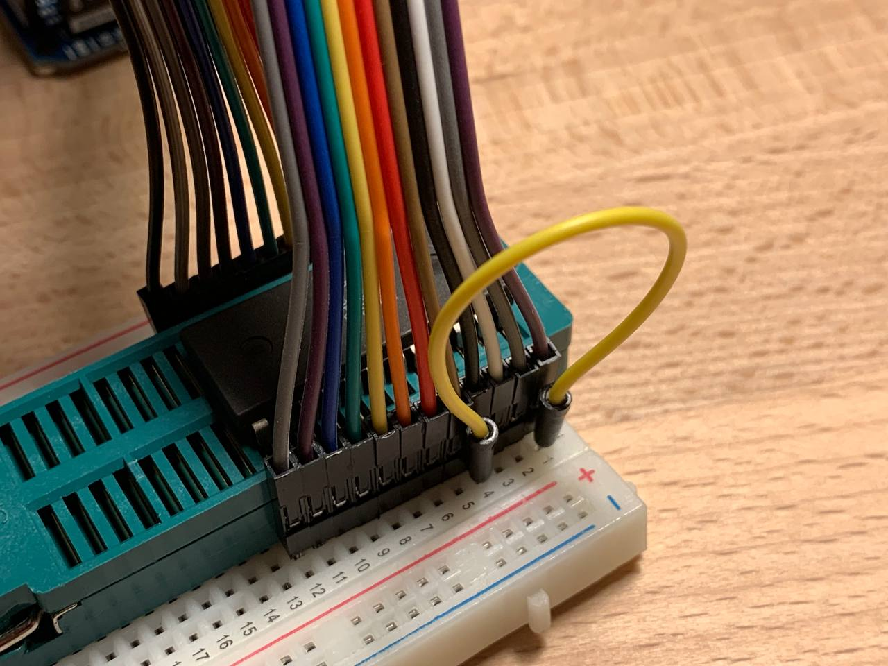
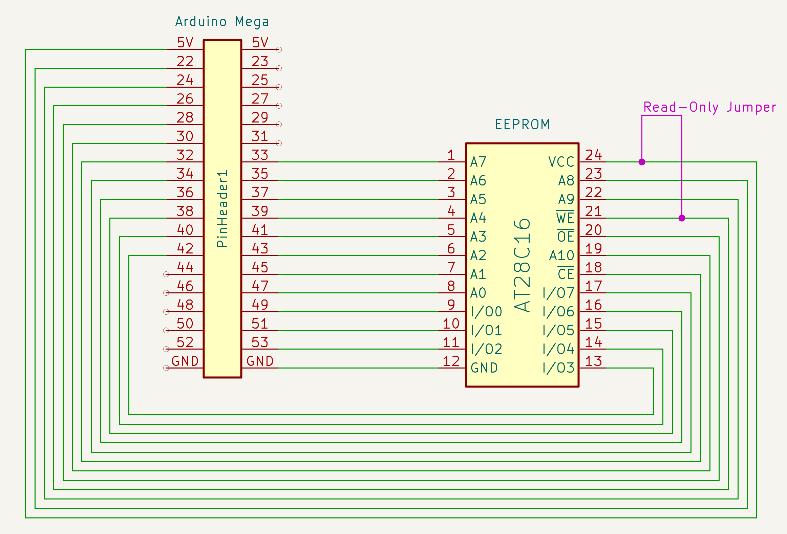
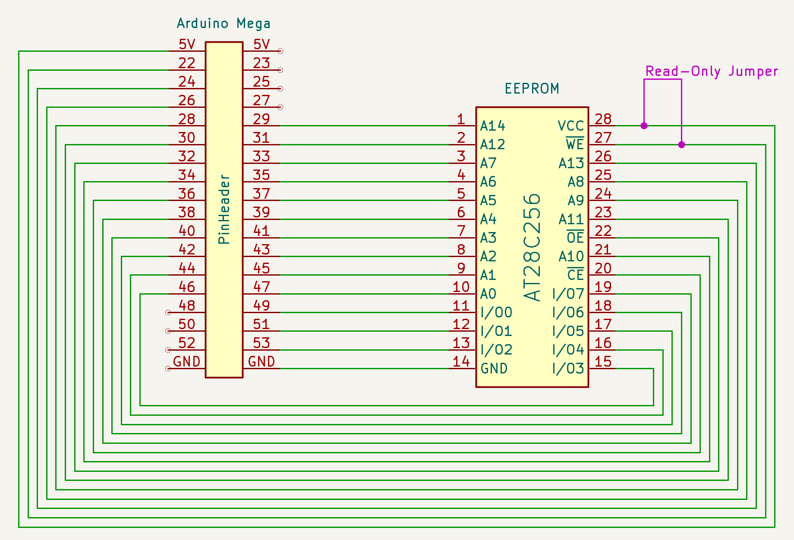
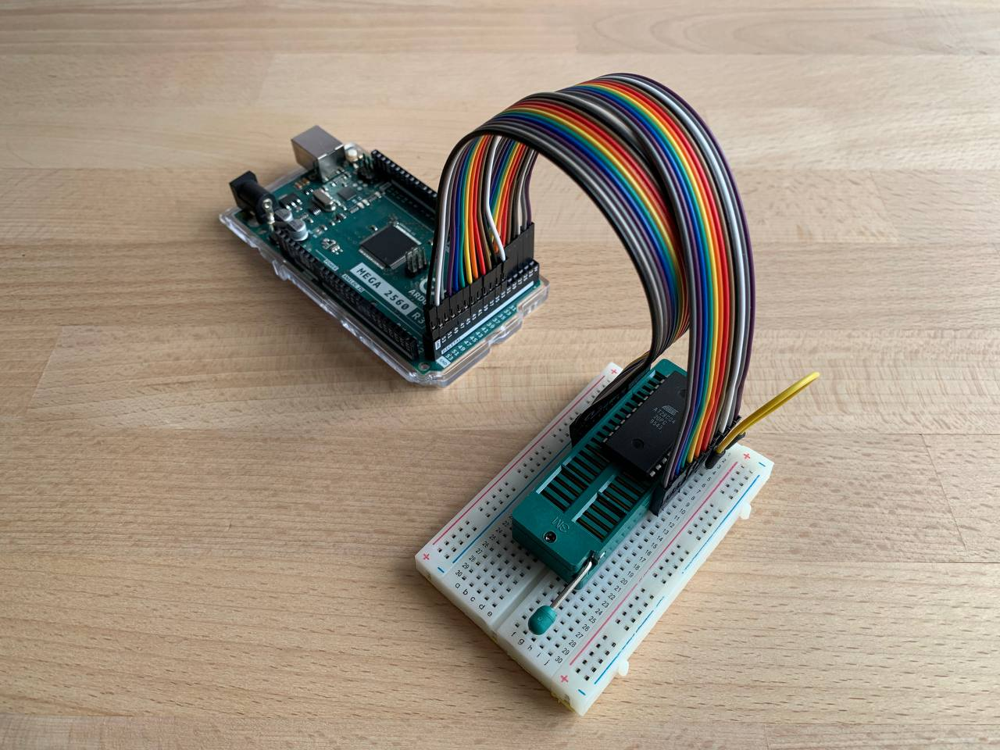
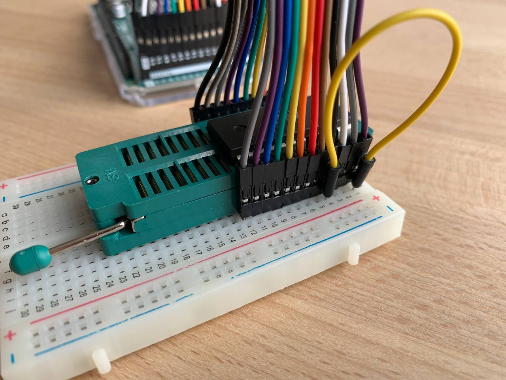
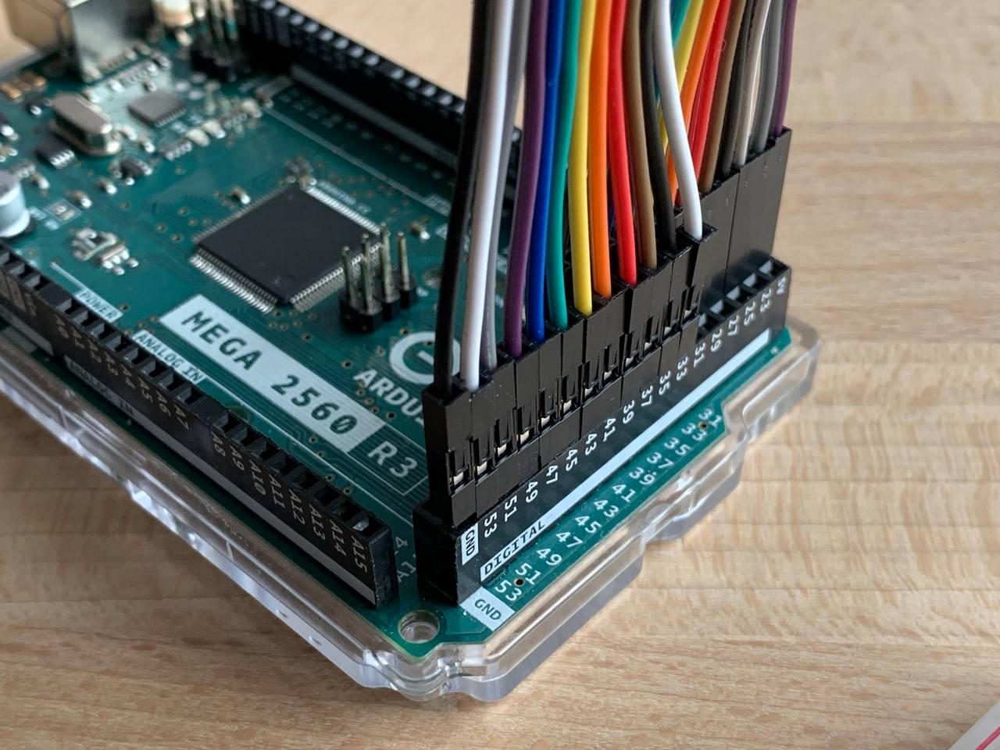

# EEPROM Programmer

## About

> [!CAUTION]
> During read operations with the EEPROM Programmer, the chip's `!WE` pin **MUST** be connected to `VCC` using a jumper wire to disable the write mode. Otherwise, invoking the CLI may corrupt data on the chip due to Arduino's internal behavior. [Details](https://goose.sh/blog/eeprom-programmer-5-data-corruption/)

> [!IMPORTANT]
> This project concerns **external** EEPROM chips, not the built-in Arduino EEPROM memory.

The EEPROM Programmer project makes it possible to use Arduino platforms with an extended set of pins to read from and write to EEPROM chips from the AT28Cxx family.

The firmware component of the project is flashed onto an Arduino Mega or Due. The EEPROM chip is then connected to the extended pin header on the board, after which the Python CLI can be used to erase, write, or read binary data.

During the development of this project, a series of articles was written. They are available on my blog here: [EEPROM Programmer posts at goose.sh](https://goose.sh/tags/eeprom-programmer/).


## Supported Chips

* `AT28C04 @ DIP24`, [datasheet](https://www.tvsat.com.pl/pdf/A/at28c04_atm.pdf)
* `AT28C16 @ DIP24`, [datasheet](http://cva.stanford.edu/classes/cs99s/datasheets/at28c16.pdf)
* `AT28C64 @ DIP28`, [datasheet](https://ww1.microchip.com/downloads/en/devicedoc/doc0001H.pdf)
* `AT28C256 @ DIP28`, [datasheet](https://ww1.microchip.com/downloads/en/DeviceDoc/doc0006.pdf)

Details in my [EEPROM Programmer: Supported Chips](https://goose.sh/blog/eeprom-programmer-8-supported-chips/) post.


## Performance

The programmer’s performance is strongly dependent on the performance of the Arduino platform it is built on; for example, the operating speed differs by 30% between the MEGA and the DUE. Here, measurements are presented for the platforms on which the solution was validated. The performance measurement details and the underlying reasons are described in my [EEPROM Programmer Performance](https://goose.sh/blog/eeprom-programmer-8-supported-chips/#eeprom-programmer-performance) post.

### Arduino MEGA, 16 MHz

| Chip | Size | Full Memory Read (sec) | Full Memory Write (sec)
| -- | :--: | :--: | :--: |
| AT28C04 | 512 x 8 | 1.4 | 1.8 |
| AT28C16 | 2K x 8 | 5.5 | 14 |
| AT28C64 | 8K x 8 | 21 | 28* |
| AT28C256 | 32K x 8 | 84 | 305 |

(*) with a [RDY/!BUSY polling](https://goose.sh/blog/eeprom-programmer-6-data-polling-vs-rdy-busy/#rdybusy-pin-polling) mode enabled

### Arduino DUE, 84 MHz

| Chip | Size | Full Memory Read (sec) | Full Memory Write (sec)
| -- | :--: | :--: | :--: |
| AT28C04 | 512 x 8 | 0.9 | 1.4 |
| AT28C16 | 2K x 8 | 3.6 | 11 |
| AT28C64 | 8K x 8 | 15 | 22 |
| AT28C256 | 32K x 8 | 56 | 85* |

(*) with a [Page-Write](https://goose.sh/blog/eeprom-programmer-7-page-write/) mode enabled.


## Data Corruption and Read-Only jumper wire

It is important to note that communication over the Serial protocol can corrupt data stored in the EEPROM memory, despite the **Hardware Protection** claimed in the datasheet. This issue is analyzed in detail in my [Data Corruption on Arduino Serial Connection Reset](https://goose.sh/blog/eeprom-programmer-5-data-corruption/) post.

To prevent data corruption, the Read-Only jumper wire should always be used, as shown in the wiring diagrams. The jumper should be removed only when rewriting the data in the chip’s memory is explicitly intended.




## Wiring

The Programmer supports two chip wiring variants: `DIP24` and `DIP28`. Each type requires its own wiring configuration and a recompilation of the code. Below is a mapping table along with the section of code that must be adjusted accordingly.

| Wiring Type | Supported Chips |
| -- | -- |
| DIP24 | AT28C04, AT28C16 |
| DIP28 | AT28C64, AT28C256 |

file: [./eeprom_programmer/eeprom_programmer.ino](./eeprom_programmer/eeprom_programmer.ino)
```cpp
// EEPROM Programmer

// specify the wiring type here
// * DIP24
// * DIP28
static EepromProgrammer eeprom_programmer(BoardWiringType::DIP24);
// static EepromProgrammer eeprom_programmer(BoardWiringType::DIP28);
```

The wiring configuration can be reconfigured in the file [./eeprom_programmer/board_wiring.h](./eeprom_programmer/board_wiring.h)

### DIP24 wiring

The pins are arranged sequentially to simplify wiring. On one side, the pins start with GND, and on the other with VCC, eliminating the need for separate power wires.



### DIP28 wiring

For the `DIP28` variant, two additional wires are added on each side.



### Wiring example

In the photographs, a short breadboard was used for the `DIP24` wiring, along with two ribbon cables and a ZIF socket for convenience. This setup is not mandatory: simple jumper wires can be used instead, and the chip may be placed directly into the breadboard.






## Programming EEPROM Chips with CLI

> [!CAUTION]
> During read operations with the EEPROM Programmer, the chip's `!WE` pin **MUST** be connected to `VCC` using a jumper wire to disable the write mode. Otherwise, invoking the CLI may corrupt data on the chip due to Arduino's internal behavior. [Details](https://goose.sh/blog/eeprom-programmer-5-data-corruption/)

A separate Python CLI was added to enable reading and writing large volumes of data. When using only the Arduino, it is not possible to program a 64 KB chip, as this does not fit into the MEGA’s memory.

Serial JSON-RPC is used to implement the interface between the CLI and the programmer. On the one hand, this simplifies the interface and accelerates the addition of new functionality; on the other, it introduces certain limitations due to significant protocol overhead. Details of using this protocol are described in my [Implementing Serial JSON-RPC API](https://goose.sh/blog/eeprom-programmer-4-serial-json-rpc-api/) post.

### Initialization

To get started, a small amount of Python “magic” is required to initialize the environment in which the CLI will run. Unfortunately, it is not a standalone application.

```bash
pip3 install virtualenv

# specify python version here 👇
PATH=${PATH}:~/Library/Python/3.9/bin/ ./env/init.sh

# activate the newly created venv
source venv/bin/activate

# add the CLI library to the python path
export PYTHONPATH=./eeprom_programmer_cli/:$PYTHONPATH
```

### Serial port selection

The CLI must be provided with the port to which the Arduino is connected. The port name can be found in the Arduino IDE or obtained by listing available ports using the following command:

```bash
python3 -m serial.tools.list_ports
...
/dev/cu.usbmodem2101
```

### Supported commands

I designed the CLI interface to closely resemble the `minipro` interface used with *XGecu* programmers.

#### read

```bash
# read data from the chip memory and write it to a binary file
./eeprom_programmer_cli/cli.py /dev/cu.usbmodem2101 -p AT28C64 --read tmp/dump_eeprom.bin

# read the binary file content with xxd
xxd tmp/dump_eeprom.bin | less
```

#### erase

```bash
# erase the chip memory with the specific pattern
./eeprom_programmer_cli/cli.py /dev/cu.usbmodem2101 -p AT28C64 --erase --erase-pattern FF
```

#### write

```bash
# erase the chip content with the default FF pattern and write the binary over it
./eeprom_programmer_cli/cli.py /dev/cu.usbmodem2101 -p AT28C64 --write test_bin/64_the_red_migration.bin

# do not erase the chip content before the write operation
./eeprom_programmer_cli/cli.py /dev/cu.usbmodem2101 -p AT28C64 --write test_bin/64_the_red_migration.bin --skip-erase

# use custom erase pattern
./eeprom_programmer_cli/cli.py /dev/cu.usbmodem2101 -p AT28C64 --write test_bin/64_the_red_migration.bin --erase-pattern CC
```

#### verify

```bash
# read data and verify it against the binary file
./eeprom_programmer_cli/cli.py /dev/cu.usbmodem2101 -p AT28C64 --verify test_bin/64_the_red_migration_AT28C64_ff.bin
```


## Troubleshooting

### Programmer error codes

check [./eeprom_programmer/eeprom_programmer_lib.h](./eeprom_programmer/eeprom_programmer_lib.h) file for error codes
```cpp
enum ErrorCode : short {
  SUCCESS = 0,
  ...
```

### Failed to init AT28C256 chip with error: 12

An unknown chip type, or a mismatch between the wiring configuration and the selected chip type. Check the DIP24 or DIP28 wiring.

```bash
init device: failed, failed to init AT28C256 chip with: error response: {'code': -32010, 'message': 'Programmer error', 'data': 'Failed to init AT28C256 chip with error: 12'}
```

On startup, the CLI reports the board wiring type that the programmer firmware was built with:
```bash
programmer_settings: {'board_wiring_type': 24, 'max_page_size': 64}
```


## Testing

### Basic CLI tests

### prepare

```bash
source venv/bin/activate
export PYTHONPATH=./eeprom_programmer_cli/:$PYTHONPATH
```

### erase

```bash
# >> remove jumper wire
./eeprom_programmer_cli/cli.py /dev/cu.usbmodem2101 -p AT28C64 --erase --erase-pattern BB --collect-performance

# >> set jumper wire
./eeprom_programmer_cli/cli.py /dev/cu.usbmodem2101 -p AT28C64 --read tmp/dump_eeprom.bin

xxd tmp/dump_eeprom.bin | less
```

### write and read

```bash
# >> remove jumper wire
./eeprom_programmer_cli/cli.py /dev/cu.usbmodem2101 -p AT28C64 --write test_bin/64_the_red_migration.bin --erase-pattern BB --collect-performance

# >> set jumper wire
./eeprom_programmer_cli/cli.py /dev/cu.usbmodem2101 -p AT28C64 --read tmp/dump_eeprom.bin

xxd tmp/dump_eeprom.bin > tmp/dump_eeprom.hex
vimdiff tmp/dump_eeprom.hex tmp/64_the_red_migration.hex
```

### verify

```bash
# >> remove jumper wire
./eeprom_programmer_cli/cli.py /dev/cu.usbmodem2101 -p AT28C64 --write test_bin/64_the_red_migration.bin --collect-performance

# >> set jumper wire
./eeprom_programmer_cli/cli.py /dev/cu.usbmodem2101 -p AT28C64 --verify test_bin/64_the_red_migration_AT28C64_ff.bin
```

### Performance testing with CLI

```
# AT28C04
./eeprom_programmer_cli/cli.py /dev/cu.usbmodem2101 -p AT28C04 --erase --erase-pattern 11 --collect-performance
./eeprom_programmer_cli/cli.py /dev/cu.usbmodem2101 -p AT28C04 --read tmp/dump_eeprom.bin --collect-performance && xxd tmp/dump_eeprom.bin | less
./eeprom_programmer_cli/cli.py /dev/cu.usbmodem2101 -p AT28C04 --write test_bin/4_journey_of_luna_AT28C04_ff.bin --skip-erase --collect-performance
./eeprom_programmer_cli/cli.py /dev/cu.usbmodem2101 -p AT28C04 --verify test_bin/4_journey_of_luna_AT28C04_ff.bin --collect-performance

# AT28C16
./eeprom_programmer_cli/cli.py /dev/cu.usbmodem2101 -p AT28C16 --erase --erase-pattern 11 --collect-performance
./eeprom_programmer_cli/cli.py /dev/cu.usbmodem2101 -p AT28C16 --read tmp/dump_eeprom.bin --collect-performance && xxd tmp/dump_eeprom.bin | less
./eeprom_programmer_cli/cli.py /dev/cu.usbmodem2101 -p AT28C16 --write test_bin/16_geese_in_space_AT28C16_ff.bin --skip-erase --collect-performance
./eeprom_programmer_cli/cli.py /dev/cu.usbmodem2101 -p AT28C16 --verify test_bin/16_geese_in_space_AT28C16_ff.bin --collect-performance

# AT28C64
./eeprom_programmer_cli/cli.py /dev/cu.usbmodem2101 -p AT28C64 --erase --erase-pattern 11 --collect-performance
./eeprom_programmer_cli/cli.py /dev/cu.usbmodem2101 -p AT28C64 --read tmp/dump_eeprom.bin --collect-performance && xxd tmp/dump_eeprom.bin | less
./eeprom_programmer_cli/cli.py /dev/cu.usbmodem2101 -p AT28C64 --write test_bin/64_the_red_migration_AT28C64_ff.bin --skip-erase --collect-performance
./eeprom_programmer_cli/cli.py /dev/cu.usbmodem2101 -p AT28C64 --verify test_bin/64_the_red_migration_AT28C64_ff.bin --collect-performance

# AT28C256
./eeprom_programmer_cli/cli.py /dev/cu.usbmodem2101 -p AT28C256 --erase --erase-pattern 11 --collect-performance
./eeprom_programmer_cli/cli.py /dev/cu.usbmodem2101 -p AT28C256 --read tmp/dump_eeprom.bin --collect-performance && xxd tmp/dump_eeprom.bin | less
./eeprom_programmer_cli/cli.py /dev/cu.usbmodem2101 -p AT28C256 --write test_bin/256_the_geometry_of_flight_AT28C256_ff.bin --skip-erase --collect-performance
./eeprom_programmer_cli/cli.py /dev/cu.usbmodem2101 -p AT28C256 --verify test_bin/256_the_geometry_of_flight_AT28C256_ff.bin --collect-performance
```

### Using XGecu programmer as a reference

Use the [`minipro`](https://formulae.brew.sh/formula/minipro) utility to perform read and write operations with the XGecu programmer

```bash
brew install minipro

# write the "real" dump to the chip
minipro --device AT28C64 -s -u --write test_bin/64_the_red_migration.bin
minipro --device AT28C256 -s -u --write test_bin/256_the_geometry_of_flight.bin

# read the data
minipro --device AT28C64 -u --read tmp/dump_xgecu.bin
minipro --device AT28C256 -u --read tmp/dump_xgecu.bin

# convert to HEX
xxd tmp/dump_xgecu.bin > tmp/dump_xgecu.hex

# compare
vimdiff tmp/dump_eeprom.hex tmp/dump_xgecu.hex
```

### JSON-RPC API

Set Arduino IDE's *Serial Monitor* on `115200` baud

`init_chip(chip_type: str)`
```json
{"jsonrpc":"2.0", "id":0, "method": "init_chip", "params": ["AT28C64"]}
```

`set_read_mode(page_size_bytes: int)`
```json
{"jsonrpc":"2.0", "id":0, "method": "set_read_mode", "params": [4]}
```

`read_page(page_no: int)`
```json
{"jsonrpc":"2.0", "id":0, "method": "read_page", "params": [0]}
```

`set_write_mode(page_size_bytes: int)`
```json
{"jsonrpc":"2.0", "id":0, "method": "set_write_mode", "params": [4]}
```

`write_page(page_no: int, data: array[int])`
```json
{"jsonrpc":"2.0", "id":0, "method": "write_page","params": [0, [127, 127, 127, 127]]}
```

#### write operation sequence

```json
{"jsonrpc":"2.0", "id":0, "method": "init_chip", "params": ["AT28C64"]}
{"jsonrpc":"2.0", "id":0, "method": "set_write_mode", "params": [4]}
{"jsonrpc":"2.0", "id":0, "method": "write_page","params": [0, [120, 130, 140, 150]]}
{"jsonrpc":"2.0", "id":0, "method": "write_page","params": [50, [20, 30, 40, 50]]}
{"jsonrpc":"2.0", "id":0, "method": "get_write_perf","params": []}
```

#### read operation sequence

```json
{"jsonrpc":"2.0", "id":0, "method": "init_chip", "params": ["AT28C64"]}
{"jsonrpc":"2.0", "id":0, "method": "set_read_mode", "params": [4]}
{"jsonrpc":"2.0", "id":0, "method": "read_page", "params": [0]}
{"jsonrpc":"2.0", "id":0, "method": "read_page", "params": [50]}
```
